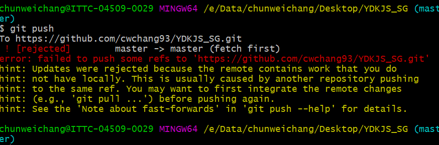

### Git Ref Conflict


<h5>0610 useRef 無法用在NtbXitu的children裡面</h5>
<h5>0610 useEffect資料有變動時強制更新</h5>

##### 刪除 array 裡面元素的方法

> 1. arr.splice(index, numOfEle)

##### useRef 父子都要用

##### js 古怪部分=>setState 非同步

##### useRef 無法取得子層 CdXi 的 function

> 原因: 因為子層裡面的 module 又有另外一層 RenderFolder 的 function
> 一開始是包在 Renderfolder() 所以沒有，因此需要再包一層

##### 邏輯對但功能出不來

> 有可能是多寫了一個(function)把前面的東西蓋掉了
> 後面蓋前面

```javascript
const [data, setData] = useState({
  photo: photoFolderData,
  video: videoFolderData,
  article: articleFolderData
});

setData(prev => {
  prev.photo = [
    ...prev.photo.data,
    {
      fileID: "123",
      fileName: inputValue, // 收藏夾名稱 [string]
      fileCoverImgSrc: "https://picsum.photos/100/150?random=2", // 收藏夾封面 [string]
      checked: true, // [boolean]
      totalNum: 0
    }
  ];
  // return {...prev, prev.photo}
  return prev;
});
```

CSS 等比例縮放
http://zihua.li/2013/12/keep-height-relevant-to-width-using-css/

CSS 針對 class 的最後一個指定行為
&:last-type-of

https://stackoverflow.com/questions/7298057/css-last-child-selector-select-last-element-of-specific-class-not-last-child-i

#### submodule 的雷

```
1. clone下來之後要先切master之後再切develop
2. 要merge feature的時候不能直接切遠端develop，先切本地再Pull遠端再合併
3. 可以在本地端feature拉遠端的develop，但GUI可能會顯示merge
=> 可以直接在GUI介面上，(feature branch上)直接對develop點右鍵pull下來
```

#### 三元表達式

要如何在一種狀況下執行兩個 function? <br>

1. 用 arrow function 包起來
2. 用短路邏輯 && ||

```javascript
const addFolder = folder => {
  folder !== ""
    ? (() => {
        setFolderArr(prev => {
          return [
            ...prev,
            {
              fileID: "",
              fileName: folder,
              totalNum: 0
            }
          ];
        });
        setFolderName("");
      })()
    : alert("請輸入資料夾名稱");
};
```

#### mac 更新掛掉 sol

```
mac安裝壞掉:
可能原因:
 網路不穩定導致更新沒有完整
解決方式:
重灌:
開機前先按住cmd+R
等出現蘋果圖案時再放開!
```

```
行政
公用作業 > 電子簽核單 > 申請單位 (00D591)

```

```javascript
function numbersCloseEnoughToEqual(n1, n2) {
  return Math.abs(n1 - n2) < Number.EPSILON;
}
var a = 0.1 + 0.2;
var b = 0.3;
numbersCloseEnoughToEqual(a, b); // true
numbersCloseEnoughToEqual(0.0000001, 0.0000002); // false
```

```
安裝typescript套件必須用npm，不要用yarn

用yarn無法

```

```
讓特定檔案不使用eslint => 直接在檔案上面加
/* eslint-disable */

```
