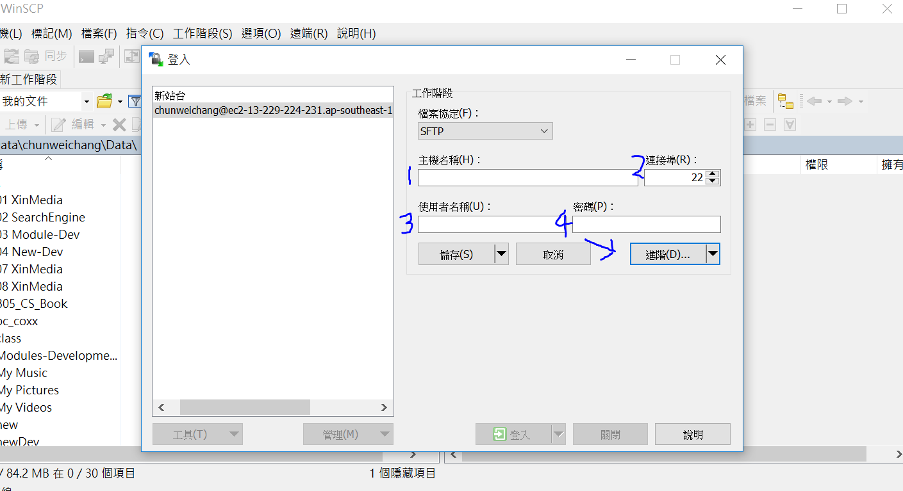
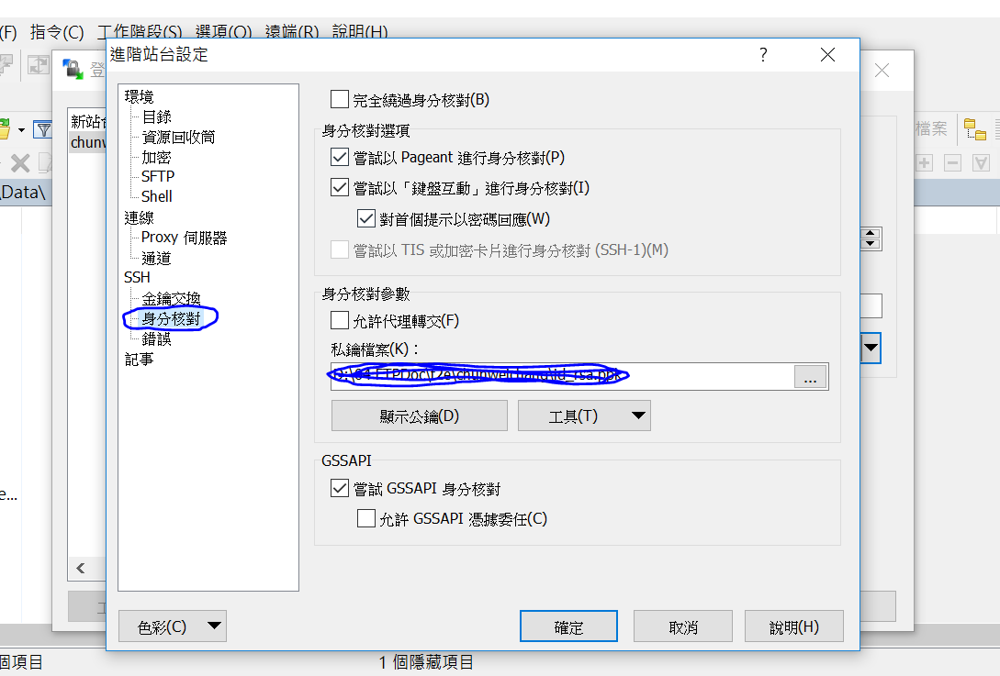

#### 串接 Api 知識

> Q1: 前端登入 FTP/SFTP 的目的為何?  
> Ans: 為了把 js 檔案放到 server 上拿 token，而非為了要取得 api 所以登入 FTP/SFTP

> Q2:

#### 登入 FTP/SFTP 設定

> 1. 安裝 WinSCP(或用 fileZilla)
> 2. 輸入
>    SFTP 登入資料/IP/port/account:各自名稱 
>    登入方式 Private Key(.ppk) (private_xinmedia_bella.ppk)
>    

> 3. 密碼部分=> 點選進階 => 身分核對 => 將金鑰存在裡面(.ppk)檔案 => 接著點選確定並儲存即可登入
>    

#### 關於 fetch

> 1. fetch 一次只能 consume(console.log)一次，否則會報錯。  
>    <a href="https://stackoverflow.com/questions/53511974/javascript-fetch-failed-to-execute-json-on-response-body-stream-is-locked"> 詳解: javascript fetch - Failed to execute 'json' on 'Response': body stream is locked </a>
> 2. 若 fetch 的 Methods 為 GET 則不能有 body
> 3. 若 fetch 的 Methods 為 POST 則 url 不能為.json 資料

#### React Router

> <h5>指令: $node server </h5>
> 路徑可至server.js看e.g. /api/user
> <h5>路由的port</h5>
> http://localhost:8080/

#### 設定 host 的路徑

> C:\Windows\System32\drivers\etc  
> 設定 hostserver
